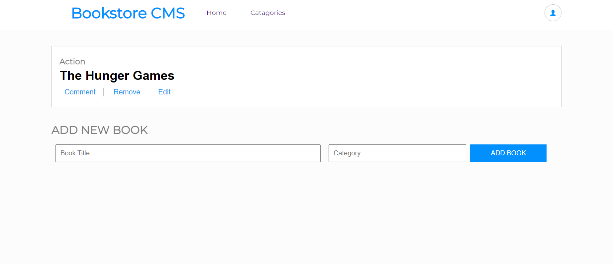

# Book Store

> This project will lay foundations for your Bookstore website. I will create a React and Redux app. I'll structure my files using the "feature folder" approach. I will also set up routing using React Router.

<!--  -->

## Built With

- HTML, CSS, and JavaScript
- React
- Redux
- git/GitHub

<!-- ## Live Demo -->

### `Getting Started
To get a local copy up and running follow these simple example steps.

  - go to the directory that you want to clone the repository in.
  - right click and choose Git Bash here.
  - type "git clone https://github.com/BereketRetta/Bookstore.git".
  - run "npm install" and then "npm start"

## Authors

👤 **Bereket**

- GitHub: [BereketRetta](https://github.com/BereketRetta)
- LinkedIn: [@Bereket](https://www.linkedin.com/in/Bereket-Retta/)

## 🤝 Contributing

Contributions, issues, and feature requests are welcome!

Feel free to check the [issues page](../../issues/).

## Show your support

Give a ⭐️ if you like this project!

## Acknowledgments

- This project is built in Microverse's second module's capstone.

## 📝 License

This project is [MIT](./MIT.md) licensed.
